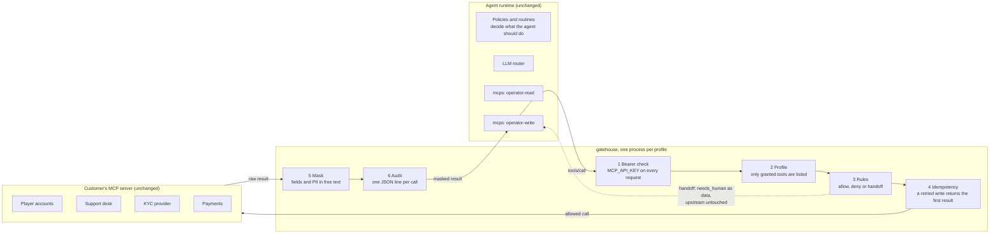
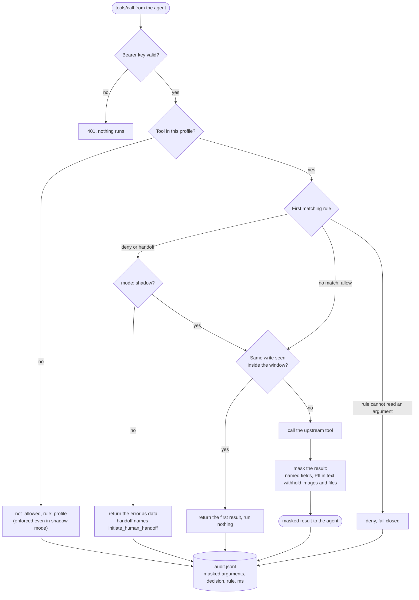
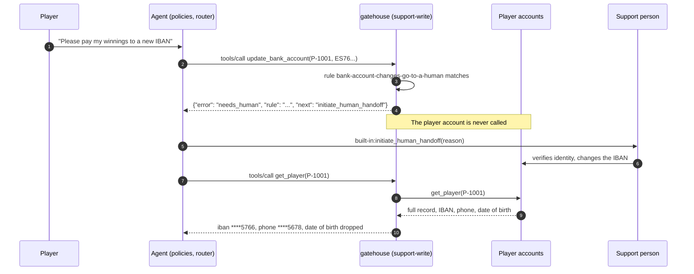

# gatehouse

**The guardrail layer you would otherwise rebuild inside every customer's MCP server.**

An agent platform attaches tools per *server*. The customer's server exposes everything it has:
the refund tool next to the lookup tool, the IBAN next to the name. So the rules that matter in a
regulated deployment (bank changes go to a person, the model never reads a document number, a
retried write never runs twice) end up hand-written into each customer's tool code, or into a
prompt, where a model can talk its way past them.

gatehouse is an MCP proxy that sits between the agent and the customer's MCP server and enforces
those rules in code, from one YAML file:

| | |
|---|---|
| **Profiles** | Each gatehouse instance serves one profile. Tools outside it are not listed and cannot be called. Attaching the profile is the permission grant. |
| **Rules** | `allow`, `deny` or `handoff`, per tool, with conditions on the arguments. First match wins. A handoff returns the reason as data and tells the agent to call its human-handoff tool. |
| **Masking** | Every result is masked before the model sees it: named fields (`iban: last4`, `date_of_birth: drop`) anywhere in the tree, and PII inside free text (IBANs, Luhn-valid card numbers, emails, phone numbers). |
| **Idempotency** | A retried write with the same arguments returns the first result instead of running again. |
| **Audit** | One JSON line per call: profile, tool, masked arguments, decision, rule, latency. |
| **Shadow mode** | `mode: shadow` records what every rule would have done and blocks nothing (results are still masked), so a first rollout can be measured before it is enforced. |
| **Auth** | Checks the bearer key on every request (`MCP_API_KEY`), because the platform does not. |

The customer's tools do not change. The agent's prompt does not change.

## Where it sits



A call the rules refuse never reaches the customer's systems. A call they allow comes back masked.
Every call leaves one audit line.

## One call, decided



## A handoff, end to end



## Two minutes, no keys

```
pip install -e .
python examples/igaming/demo.py
```

A support agent on a regulated iGaming desk (player accounts, tickets, KYC; all data fake):

```
support-read   sees 3 of 9 upstream tools: get_player, get_ticket, list_transactions
support-write  sees 8 of 9 upstream tools: add_ticket_comment, apply_bonus, close_ticket, get_player, ...

  look up the player                     get_player           -> iban ****1332, phone ****5678, email ***@example.com, dropped date_of_birth, document_number
  read a ticket with an IBAN in it       get_ticket           -> "Withdrawal of 40 EUR pending 3 days. Please send it to ****1332, or call me on ****5678."
  player asks to change the payout IBAN  update_bank_account  -> NEEDS_HUMAN  [bank-account-changes-go-to-a-human]
  10 EUR goodwill bonus                  apply_bonus          -> {"bonus_id": "B-9001", ..., "new_balance_eur": 52.5}
  model retries after a timeout          apply_bonus          -> {"bonus_id": "B-9001", ..., "new_balance_eur": 52.5}
  120 EUR bonus                          apply_bonus          -> NEEDS_HUMAN  [bonus-above-50-needs-a-supervisor]
  player asks to self-exclude            set_self_exclusion   -> NEEDS_HUMAN  [self-exclusion-goes-to-a-human]
  close with no resolution               close_ticket         -> NOT_ALLOWED  [close-only-with-a-resolution]
  a tool in no profile                   export_player_data   -> NOT_ALLOWED  [profile]

balance after two identical 10 EUR calls: 52.50 EUR (started at 42.50)
```

## The config

```yaml
upstream: http://operator-mcp:8765/mcp    # any streamable-http MCP server, or a local .py file
api_key: ${MCP_API_KEY}
audit_log: audit.jsonl

profiles:
  support-read:  { tools: [get_player, list_transactions, get_ticket] }
  support-write: { tools: [get_player, list_transactions, get_ticket, add_ticket_comment,
                           close_ticket, apply_bonus, update_bank_account, set_self_exclusion] }

mask:
  fields: { iban: last4, phone: last4, email: domain, date_of_birth: drop, document_number: drop }
  patterns: [iban, card, email, phone]

rules:
  - id: bank-account-changes-go-to-a-human
    tools: [update_bank_account]
    action: handoff
    reason: Bank account changes are always handled by a person.
  - id: bonus-above-50-needs-a-supervisor
    tools: [apply_bonus]
    when: { amount_eur: { gt: 50 } }
    action: handoff

idempotency:
  tools: [apply_bonus, add_ticket_comment, update_bank_account]
  window_seconds: 600
```

Conditions: `gt`, `gte`, `lt`, `lte`, `equals`, `in`, `matches` (regex), `missing`. The full example is
[examples/igaming/gatehouse.yaml](examples/igaming/gatehouse.yaml).

## Running it in front of a real server

```
gatehouse examples/igaming/gatehouse.yaml --profile support-write --port 8766
```

It serves streamable-http at `/mcp`. In an InteractiveAI agent manifest it is an ordinary MCP entry,
one per profile:

```yaml
agent_config:
  mcps:
    - id: operator                       # tools appear as operator:get_player
      hostname: http://gatehouse-support-write
      port: 8766
      api_key: ${GATEHOUSE_KEY}
```

Or as a platform-hosted MCP, from the included Dockerfile:

```
iai mcps create gatehouse-support-write --image-name gatehouse --image-tag v1 --port 8766
```

## Tests

```
python -m unittest discover -s tests
```

29 tests: every rule; shadow mode; masking edge cases (only Luhn-valid card numbers, amounts and ticket ids
untouched); the idempotency window; the full proxy in memory; a real streamable-http run that refuses
a call without the bearer key and still applies the rules with it; and a set of bypass regressions.

## Fails closed

A guardrail that can be argued past is a suggestion. gatehouse reads arguments the way the
upstream's validator will execute them, and refuses whatever it cannot read:

* `"true"`, `"1"`, `"yes"` are true and `"120"` is 120, so a rule never decides on a string while the
  tool runs on the coerced value.
* `NaN`, infinities and booleans in an amount are refused, not compared (`NaN > 50` is false).
* A rule that cannot evaluate an argument denies the call; whitespace counts as missing.
* `IBAN`, `iban` and `dateOfBirth` / `date_of_birth` are the same field to the masker.
* Content it cannot inspect (an image of an ID document, an embedded file) is withheld.
* It proxies tools only. Upstream resources and prompts would bypass every rule and mask, so they are
  neither listed nor readable through gatehouse.
* Shadow mode softens rules, never the profile: a tool outside the profile is refused in every mode.
* The bearer key is compared in constant time, and if the config asks for a key that resolves empty,
  gatehouse refuses to start rather than serving unauthenticated.

## Limits, honestly

* Masking is pattern- and field-based. A secret paraphrased into prose with no recognisable shape
  gets through; the field rules are the first line, a human on irreversible actions the last.
* Idempotency is an in-process dict: correct for one replica, Redis for several.
* One process per profile. Per-tool permissions inside the platform's own manifest would make that
  unnecessary, and would be the better long-term home for this.

MIT. Built by [Sri Krishna Vamsi D](https://github.com/srikrishnavansi).
